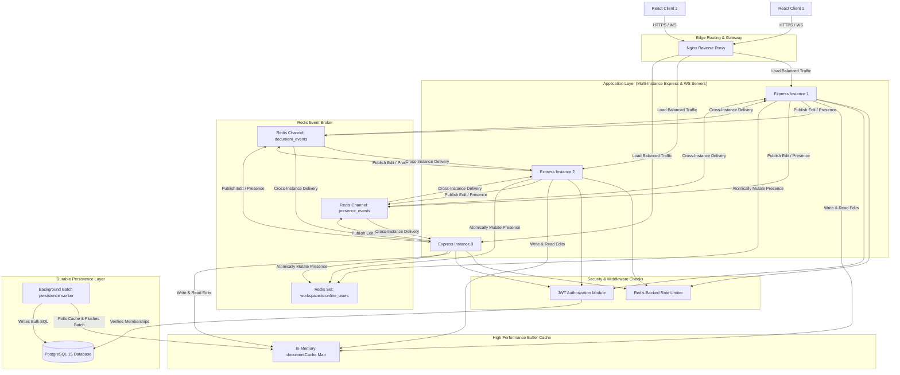
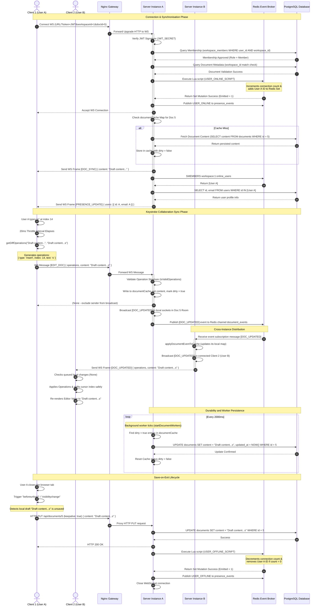

# 📝 LiveDesk

> **LiveDesk** provides real-time collaborative document editing with workspace-based access control by using an optimized diff-rebase synchronization protocol over WebSockets paired with a Redis-backed multi-instance pub/sub and write-back database cache — delivering sub-50ms synchronization latency with robust offline editing and zero database write-bottlenecks.

---

## Table of Contents
1. [Pipeline Architecture & System Design](#2-pipeline-architecture--system-design)
2. [How It Works (Sequence Diagram)](#3-how-it-works-sequence-diagram)
3. [Split-Phase Pipelines / Core System Flow](#4-split-phase-pipelines--core-system-flow)
   - [Flow 1: Collaborative Document Sync](#flow-1-collaborative-document-sync)
   - [Flow 2: Online Presence Management](#flow-2-online-presence-management)
   - [Flow 3: Persistence and Durability](#flow-3-persistence-and-durability)
   - [Graceful Fallbacks](#graceful-fallbacks)
4. [Monorepo Architecture](#5-monorepo-architecture)
5. [Key Features & Advanced Safeguards](#6-key-features--advanced-safeguards)
6. [Engineering Trade-offs](#7-engineering-trade-offs)
7. [Tech Stack & Technology Selection](#8-tech-stack--technology-selection)
8. [Project Structure (ASCII Directory Map)](#9-project-structure-ascii-directory-map)
9. [Prerequisites & Environment Variables](#10-prerequisites--environment-variables)
10. [Running Locally](#11-running-locally)
    - [Bare-Metal Environment Setup](#bare-metal-environment-setup)
    - [Docker Compose Environment Setup](#docker-compose-environment-setup)
    - [Verifying the Installation (Triggering a Test Event)](#verifying-the-installation-triggering-a-test-event)
11. [System Taxonomy & Configuration Matrices](#12-system-taxonomy--configuration-matrices)
12. [Comprehensive API Routes Table](#13-comprehensive-api-routes-table)

---

## 2. Pipeline Architecture & System Design

The architecture is designed as a modular monolith scaled horizontally across multiple instances. Nginx acts as a reverse proxy, load-balancing traffic and routing WebSockets and REST API requests to the active Express server instances. Redis is the synchronization backbone, performing pub/sub broadcasting for document updates and presence states, rate limiting connection requests, and tracking active workspace users.



---

## 3. How It Works (Sequence Diagram)

The following sequence diagram illustrates the lifecycle of a user opening a document, typing edits (which are throttled, diffed, transmitted, broadcasted, rebased, and cached), and closing the browser tab triggering the save-on-exit sequence.



---

## 4. Split-Phase Pipelines / Core System Flow

### Flow 1: Collaborative Document Sync
*Tracks, filters, synchronizes, and renders live edits across isolated browser instances.*

#### Phase 1: Edit Diff and Queueing
- **Inputs**: Raw character inputs and selections inside the [DocumentEditor.tsx](file:///home/shamky/Ayush%20programming/Projects/LiveDesk/frontend/src/pages/DocumentEditor.tsx) textarea.
- **Component/Logic Location**: `frontend/src/pages/`[DocumentEditor.tsx](file:///home/shamky/Ayush%20programming/Projects/LiveDesk/frontend/src/pages/DocumentEditor.tsx) (handling `handleChange`) and `frontend/src/utils/`[diff.ts](file:///home/shamky/Ayush%20programming/Projects/LiveDesk/frontend/src/utils/diff.ts) (providing `getDiffOperations`).
- **Operational Process**: 
  As the user type-inputs, the values are captured. To prevent hammering the WebSocket connection, updates are throttled. When the 20ms throttle timer expires, the frontend compares the current editor state against `contentRef.current` (the baseline version from the server) using a custom single-span diffing tool. The diff algorithm (`getDiffOperations`) scans for matching prefixes and suffixes, isolating the changed index range to format a single `insert`, `delete`, or `replace` `DiffOperation`. The baseline `contentRef.current` is immediately updated to match the sent content.
- **Safety Features**:
  - **Size Cap**: Edits are rejected if the document exceeds 100,000 characters.
  - **Bounded Message Queueing**: If the socket is offline, message payloads are stored in an outbound queue (`messageQueue`) capped at 200 messages in [client.ts](file:///home/shamky/Ayush%20programming/Projects/LiveDesk/frontend/src/ws/client.ts) to prevent memory bloating.

#### Phase 2: Distributed Event Broadcast and Cache Update
- **Inputs**: `EDIT_DOC` WS frames containing `operations` and optional full `content` from the client.
- **Component/Logic Location**: `backend/src/websocket/`[ws.server.js](file:///home/shamky/Ayush%20programming/Projects/LiveDesk/backend/src/websocket/ws.server.js) (ingestion & validation), `backend/src/modules/document/`[document.realtime.js](file:///home/shamky/Ayush%20programming/Projects/LiveDesk/backend/src/modules/document/document.realtime.js) (cache write), and `backend/src/modules/document/`[document.pubsub.js](file:///home/shamky/Ayush%20programming/Projects/LiveDesk/backend/src/modules/document/document.pubsub.js) (redis publisher).
- **Operational Process**:
  Upon message receipt, the server checks the message structure using `isValidOperations`. It updates the server node's local `documentCache` Map, marks `dirty = true`, and updates the timestamp (`lastAccess`). The message is broadcast to all other connections sharing the same `docId` on the local instance. Concurrently, `publishDocumentEvent` fires a Redis message containing the operations and full content down the `document_events` channel. Other backend instances subscribe to this channel, update their local cache references via `applyDocumentEventToCache`, and re-broadcast to their local WebSocket rooms.
- **Safety Features**:
  - **Strict Operation Schema Validation**: Rejects malformed payload formats to prevent buffer overflows or malicious script injection.
  - **Rebase Resolution**: If the client receives a remote edit while holding local unsent edits in its buffer queue, `rebaseDraftOntoContent` computes the user's intent, shifts selection coordinates via `getSelectionAfterOperations`, and applies it, avoiding editor content reset.

---

### Flow 2: Online Presence Management
*Maintains transient real-time member counters and avatars inside shared workspaces.*

#### Phase 1: Connection Tracking via Lua Scripting
- **Inputs**: HTTP WebSocket upgrade request query keys: `token`, `workspaceId`, `docId`.
- **Component/Logic Location**: `backend/src/websocket/`[ws.server.js](file:///home/shamky/Ayush%20programming/Projects/LiveDesk/backend/src/websocket/ws.server.js) (WS Connection Event), and `backend/src/modules/presence/`[presence.logic.js](file:///home/shamky/Ayush%20programming/Projects/LiveDesk/backend/src/modules/presence/presence.logic.js) (providing `userOnline` and `userOffline` scripts).
- **Operational Process**:
  When a WebSocket opens, the query arguments are validated. The server parses the JWT to extract `userId`, verifies database records using `isWorkspaceMember`, and checks document integrity. To maintain a single online status indicator across multiple browser tabs opened by the same user, an atomic Lua script `USER_ONLINE_SCRIPT` runs inside Redis. It increments a user connection count key `workspace:{workspaceId}:user:{userId}:connection_count`. If the increment results in exactly `1` (indicating a transition from offline to online), the user's ID is added to the Redis set `workspace:{workspaceId}:online_users`.
- **Safety Features**:
  - **Connection Upgrade Blocking**: Connections are dropped immediately if the token is invalid or the database membership checks fail.
  - **Atomic Lua Scripts**: Eliminates race conditions in Redis key updates when multiple connections or tabs open simultaneously.

#### Phase 2: Ephemeral Broadcast and DB Lookup
- **Inputs**: Redis Pub/Sub events matching channels `presence_events`.
- **Component/Logic Location**: `backend/src/modules/presence/`[presence.pubsub.js](file:///home/shamky/Ayush%20programming/Projects/LiveDesk/backend/src/modules/presence/presence.pubsub.js) and `backend/src/modules/presence/`[presence.service.js](file:///home/shamky/Ayush%20programming/Projects/LiveDesk/backend/src/modules/presence/presence.service.js) (wrapping presence managers).
- **Operational Process**:
  When the connection script returns `1`, a `USER_ONLINE` event publishes to Redis. The backend instances capture the event, query Redis (`smembers`) to get all online user IDs in that workspace, and join those IDs with user records in Postgres to get email addresses. A `PRESENCE_UPDATE` package containing the IDs and emails is broadcast to all active WebSocket connections in the workspace.
- **Safety Features**:
  - **Liveness Heartbeats**: The server sends WebSocket pings every 30 seconds. Connections that fail to respond are terminated, triggering `ws.on("close")` which runs `USER_OFFLINE_SCRIPT` to clean up Redis presence sets.

---

### Flow 3: Persistence and Durability
*Buffers high-frequency edits in memory and writes them to PostgreSQL without blocking queries.*

#### Phase 1: In-Memory Dirty Cache and Rebase
- **Inputs**: Throttled operations processed by [handleDocEdit](file:///home/shamky/Ayush%20programming/Projects/LiveDesk/backend/src/modules/document/document.realtime.js).
- **Component/Logic Location**: `backend/src/websocket/`[cacheModule.js](file:///home/shamky/Ayush%20programming/Projects/LiveDesk/backend/src/websocket/cacheModule.js) (exporting `documentCache` Map).
- **Operational Process**:
  When an edit is received, the server checks if the document exists in its memory cache (`documentCache`). If not, it fetches it from PostgreSQL and caches it. Edits apply directly to this cache, setting `dirty = true` and updating `lastAccess = Date.now()`. To prevent memory leaks, an eviction timer checks the cache every 5 minutes and deletes documents that haven't been accessed for more than 5 minutes.
- **Safety Features**:
  - **Memory Eviction Protection**: The eviction check (`IDLE_LIMIT = 5 * 60 * 1000`) only deletes documents where the last access exceeds the limit. Dirty flags are preserved in memory until flushed, ensuring no unsaved edits are lost during eviction.

#### Phase 2: Batch Persistence and Save-On-Exit Keepalive
- **Inputs**: Periodic cron tick (2000ms interval) or tab closing events.
- **Component/Logic Location**: `backend/src/modules/document/`[document.worker.js](file:///home/shamky/Ayush%20programming/Projects/LiveDesk/backend/src/modules/document/document.worker.js) (background flush loops) and `frontend/src/pages/`[DocumentEditor.tsx](file:///home/shamky/Ayush%20programming/Projects/LiveDesk/frontend/src/pages/DocumentEditor.tsx) (exit persistence lifecycle).
- **Operational Process**:
  Every 2 seconds, the worker scans the `documentCache` Map. It gathers dirty records (up to a batch size of 100) and writes the current text to PostgreSQL:
  ```sql
  UPDATE documents SET content = $1, updated_at = NOW() WHERE id = $2
  ```
  Once updated, the document's dirty flag is reset to `false`.
  On the client side, if a user navigates away or closes their tab, window event handlers (`beforeunload`, `pagehide`, and `visibilitychange`) trigger `persistDocumentOnExit` via a fetch request with `keepalive: true`. This request updates the database immediately, saving any pending changes before the browser process terminates.
- **Safety Features**:
  - **Batch Limitations**: Limits writes to 100 documents per tick to prevent database I/O bottlenecks.
  - **Fetch Keepalive**: Bypasses typical CORS/process lifecycles to ensure data saves even on abrupt tab closes.

---

### Graceful Fallbacks

| Failure Event | Impacted Component | Detection Mechanism | Recovery / Fallback Path |
| :--- | :--- | :--- | :--- |
| **WebSocket Disconnect** | Real-time Synchronization | Client `socket.onclose` event handler. | Client transitions status state to `offline`. A bounded queue of up to 200 operations is maintained. The client attempts to reconnect using an exponential backoff loop with randomized jitter. |
| **Redis Down** | Horizontal Synchronization & Presence | Node `redis.on("error")` handler / connection loss. | Server nodes fallback to single-instance operation. WebSocket broadcast remains operational for clients connected to the same server node. Cross-instance synchronization and presence updates are bypassed. |
| **Postgres Database Offline** | Write-Back Durability & Connection Handshake | Connection pool timeouts / query execution errors. | The background persistence worker logs the write failure, skips the document update, and retains the cache entry with its `dirty` flag set to `true`. Edits remain available in memory, and the system attempts to persist them again on the next tick. |

---

## 5. Monorepo Architecture

LiveDesk is organized as a monorepo containing the application components, reverse proxies, and infrastructure scripts.

| Path | Directory Name | Primary Responsibility |
| :--- | :--- | :--- |
| [backend](file:///home/shamky/Ayush%20programming/Projects/LiveDesk/backend) | Server Application | Hosts the Express REST endpoints, WebSocket event server, Redis connection pools, dirty-cache worker loops, database migration scripts, and authentication rate-limiters. |
| [frontend](file:///home/shamky/Ayush%20programming/Projects/LiveDesk/frontend) | Frontend UI SPA | Contains the React 19 SPA. Handles Markdown editing, cursor adjustments, diff generation, WebSocket connection status, and page-exit persistence. |
| [nginx](file:///home/shamky/Ayush%20programming/Projects/LiveDesk/nginx) | Proxy Routing | Houses Nginx routing rules (`nginx.conf`) and the multi-stage Docker build file that builds the React application and mounts static assets. |
| Root | Configurations | Contains [docker-compose.yml](file:///home/shamky/Ayush%20programming/Projects/LiveDesk/docker-compose.yml) for orchestration, database backup scripts, and project documentation. |

---

## 6. Key Features & Advanced Safeguards

- **Real-Time Workspace Isolation**: Employs room-based WebSocket routing. Clients join rooms segmented by `workspaceId` and `docId` after verifying membership in PostgreSQL, preventing cross-tenant access.
- **Write-Back Database Cache Buffer**: Buffers keyboard updates in memory (`documentCache`) and flushes them to the database in batches every 2 seconds. This protects PostgreSQL from disk write saturation.
- **Custom Redis-Backed Rate Limiting**: Implements three separate Redis rate limiters:
  - **General API Limiter**: Limits general API requests to 120 per minute based on IP address.
  - **Brute-Force Auth Limiter**: Restricts login/register attempts to 5 per 10 minutes based on IP + email, protecting against brute-force attacks.
  - **Workspace Abuse Limiter**: Restricts workspace-join requests to 15 per 5 minutes based on IP + user ID, protecting against spam attempts.
- **Offline Sync & Operational Rebase**: Enables offline editing. When the client reconnects, the system syncs the document baseline and uses `rebaseDraftOntoContent` to re-apply unsent local changes on top of the new baseline.
- **Cursor Position Tracking**: Uses `getSelectionAfterOperations` to adjust the cursor index during remote updates, preventing the user's cursor from jumping when other users insert or delete text.
- **Clean Database Schema**: Database schema uses indexes for performance:
  - Indexes on `workspace_members(user_id)` and `workspace_members(workspace_id)` for quick membership checks.
  - Index on `documents(workspace_id, updated_at DESC)` for fast document sidebar rendering.
  - Foreign keys use `ON DELETE CASCADE` to prevent orphan records.

---

## 7. Engineering Trade-offs

### Single-Span Diff-Rebase vs. Operational Transformation (OT) / CRDTs
- **Rationale**: Implementing full collaborative algorithms (like Yjs, Automerge, or ShareDB) increases library bundle sizes, adds state overhead, and requires complex custom database adapters. LiveDesk uses a lightweight single-span diffing model with client-side rebasing, which works on a simple raw HTML `<textarea>`.
- **Consequences**: Significantly simplifies the codebase and improves performance. However, because it calculates a single-span diff (prefix/suffix matching), concurrent edits in different parts of a document can occasionally be merged into a single `replace` block. If two edits occur inside the same boundaries simultaneously, it may cause one user's edit to overwrite another's. This trade-off is suitable for smaller teams where simultaneous editing of the same line is rare.

### Write-Back Buffer Cache vs. Write-Through Persistence
- **Rationale**: Synchronous database writes on every keypress would overwhelm PostgreSQL with disk I/O under moderate load. LiveDesk buffers writes in an in-memory Cache and flushes them to Postgres every 2 seconds.
- **Consequences**: High-performance, low-latency editing and highly scalable. The trade-off is a 2-second durability window; if the server node crashes, edits made within the last 2 seconds (not yet flushed) might be lost. This is a standard trade-off in collaborative editors (e.g., Google Docs, Figma), where editor performance and low database load are prioritized over immediate durability.

### Distributed Redis Pub/Sub vs. Sticky-Session WebSockets
- **Rationale**: WebSockets are stateful. To scale horizontally, we must run multiple backend instances. Without a shared communication backbone, users connected to Instance 1 wouldn't see updates from users on Instance 2.
- **Consequences**: Redis Pub/Sub acts as a horizontal scale-out mechanism, allowing instances to share messages and scale. The downside is increased network hop latency between nodes (usually <5ms) and another infrastructure dependency.

### LocalStorage JWT vs. Secure HttpOnly Cookies
- **Rationale**: Storing JWTs in `localStorage` is simple, allows easy client-side extraction to pass tokens as WebSocket query parameters, and avoids CORS cookie forwarding setup issues.
- **Consequences**: Simpler implementation, but exposes the application to XSS token theft. In production, using HttpOnly cookies with a token-exchange route for WebSockets would be more secure.

---

## 8. Tech Stack & Technology Selection

### Backend
- **Node.js (v18+)**: Chosen for its single-threaded event loop and asynchronous I/O model, which is ideal for real-time WebSocket applications.
- **Express (v5)**: Used as a lightweight, unopinionated framework for handling HTTP routing and REST endpoints.
- **ws**: A high-performance, raw WebSocket implementation for Node.js, chosen over Socket.io to keep connection overhead minimal.
- **ioredis**: A robust, feature-rich Redis client for Node.js that supports Lua scripting and pub/sub.
- **pg**: A non-blocking PostgreSQL client for Node.js, providing connection pooling for database queries.
- **jsonwebtoken & bcrypt**: Industry standards for signing authorization tokens and hashing passwords securely.

### Frontend
- **React (v19)**: Selected for its component-based architecture and state-management capabilities.
- **Vite**: A fast build tool and development server, chosen over Webpack to improve build times and hot-module replacement.
- **TypeScript**: Adds static typing to Javascript, reducing runtime errors and improving codebase maintainability.
- **Tailwind CSS**: A utility-first CSS framework for rapid UI development and consistent styling.

### Infrastructure & Operations
- **Nginx**: Acts as a reverse proxy, load balancer, and static file server, simplifying CORS management and SSL termination.
- **PostgreSQL (v15)**: A robust, open-source relational database used for storing durable user, workspace, and document data.
- **Redis (v7)**: An in-memory data store used for pub/sub message brokering, presence tracking sets, and rate limiting.
- **Docker & Docker Compose**: Containerizes the application services (Nginx, Express backends, Postgres, Redis) to ensure consistent environment configuration and deployment.

---

## 9. Project Structure (ASCII Directory Map)

```text
LiveDesk/
├── backend/                                   # Backend codebase root
│   ├── Dockerfile                             # Containerization settings for Backend service
│   ├── migrations/                            # PostgreSQL migrations schema definitions
│   │   ├── 001_init.sql                       # Database schema creation (tables: users, workspaces, members, docs)
│   │   └── 002_init.sql                       # Performance indices setup for workspace membership & document lookup
│   ├── package.json                           # Backend dependencies & script definitions
│   └── src/                                   # Backend source directory
│       ├── app.js                             # Express application setups, routing mappings & standard middleware
│       ├── server.js                          # Core server entry point (database check, dependency verification & WebSocket server init)
│       ├── config/                            # Database connection configs
│       │   ├── postgres.js                    # PostgreSQL pool exports configuration
│       │   └── redis.js                       # Redis connection setup exports configuration
│       ├── middlewares/                       # Express server middlewares
│       │   ├── auth.middleware.js             # requireAuth JWT header validations
│       │   └── rate-limit.middleware.js       # Redis-backed rate limiting configurations
│       ├── websocket/                         # WebSocket management files
│       │   ├── cacheModule.js                 # In-memory documentCache and dirty checks
│       │   └── ws.server.js                   # WebSocket Connection handlers, heartbeats, message routers & room broadcasts
│       └── modules/                           # Feature modules (Controller-Service-Repository pattern)
│           ├── auth/                          # Authentication module
│           │   ├── auth.controller.js         # Register, login & me routes
│           │   ├── auth.repo.js               # SQL database interactions for users
│           │   └── auth.service.js            # Authentication business logic & password validations
│           ├── document/                      # Document management module
│           │   ├── document.controller.js     # Document CRUD routing endpoints
│           │   ├── document.operations.js     # Text operation processors (insert, delete, replace)
│           │   ├── document.pubsub.js         # Redis pub/sub publishers and subscribers for document events
│           │   ├── document.realtime.js       # WebSocket edit events handlers, cache writers & local broadcasts
│           │   ├── document.repo.js           # SQL queries for documents
│           │   ├── document.service.js        # Document business logic
│           │   └── document.worker.js         # Background worker that flushes dirty cache to DB every 2s
│           ├── presence/                      # Real-time user presence tracking module
│           │   ├── presence.controller.js     # REST endpoints for active presence counts
│           │   ├── presence.logic.js          # Redis set management & atomic Lua scripts
│           │   ├── presence.pubsub.js         # Redis pub/sub publishers and subscribers for presence events
│           │   └── presence.service.js        # Presence manager instantiations
│           └── workspace/                     # Workspace management module
│               ├── workspace.controller.js    # Workspace CRUD endpoints & join route handlers
│               ├── workspace.repo.js          # SQL queries for workspaces and membership associations
│               └── workspace.service.js       # Workspace business logic
├── frontend/                                  # Frontend codebase root
│   ├── index.html                             # SPA Entry page
│   ├── package.json                           # Frontend configurations & dependencies (React, Vite, Tailwind)
│   ├── postcss.config.js                      # PostCSS styles configs
│   ├── src/                                   # Frontend source code
│   │   ├── App.css                            # Global application styles
│   │   ├── App.tsx                            # React routing tree and page mounts
│   │   ├── index.css                          # Tailwind configurations & root design tokens
│   │   ├── main.tsx                           # React entry point
│   │   ├── api/                               # Axios HTTP client requests and keepalive fetch exports
│   │   ├── assets/                            # Application icons & logo assets
│   │   ├── auth/                              # Authentication context hooks
│   │   ├── components/                        # Shared UI components (Buttons, inputs, skeletons)
│   │   ├── pages/                             # Route pages
│   │   │   ├── ComingSoon.tsx                 # Future features page
│   │   │   ├── DocumentEditor.tsx             # Interactive collaborative editor with diff-rebase logic
│   │   │   ├── Home.tsx                       # Dashboard home landing layout page
│   │   │   ├── Login.tsx                      # Login page
│   │   │   ├── NotFound.tsx                   # 404 page
│   │   │   ├── Register.tsx                   # Registration page
│   │   │   ├── WorkspacePage.tsx              # Workspace dashboard parent mount
│   │   │   └── Workspaces.tsx                 # Workspace join, list & create page
│   │   ├── types/                             # Type definitions for document and WebSocket schemas
│   │   ├── utils/                             # Utility helpers
│   │   │   └── diff.ts                        # Client-side diff and merge tools
│   │   └── ws/                                # WebSocket configurations
│   │       └── client.ts                      # WebSocket client manager (reconnects, backoffs & message queues)
│   ├── tailwind.config.js                     # Tailwind theme configurations
│   └── vite.config.ts                         # Vite configuration settings
├── nginx/                                     # Nginx server proxy setups
│   ├── Dockerfile                             # Frontend multi-stage build and deployment settings
│   └── nginx.conf                             # Nginx configuration (ports, routing proxies & header upgrades)
└── docker-compose.yml                         # Orchestrator setting up 3 backend nodes, Postgres database, and Redis
```

---

## 10. Prerequisites & Environment Variables

### Prerequisites
- **Node.js**: `v18.x` or higher
- **npm**: `v9.x` or higher
- **Docker**: `v20.x` or higher
- **Docker Compose**: `v2.x` or higher
- **PostgreSQL**: `v15.x` (if running bare-metal)
- **Redis**: `v7.x` (if running bare-metal)

### Environment Variables
Configure the environment variables using the templates below.

#### Backend Env (`backend/.env`)
Create a file at `backend/.env`:
```bash
# Server Runtime Settings
PORT=4000                           # Port where the server runs (mapped by Nginx)
CLIENT_URL=http://localhost         # Allowed CORS origin URL (Frontend host)
JWT_SECRET=super-secret-key-change-in-prod  # Secret key used for signing JWT tokens

# PostgreSQL Configuration
POSTGRES_HOST=127.0.0.1             # Postgres host address (set to 'postgres' inside docker-compose)
POSTGRES_PORT=5432                  # Database port
POSTGRES_USER=admin                 # Database username
POSTGRES_PASSWORD=admin             # Database password
POSTGRES_DB=livedesk                # Database name

# Redis Configuration
REDIS_HOST=127.0.0.1                # Redis host address (set to 'redis' inside docker-compose)
REDIS_PORT=6379                  # Redis port
```

#### Frontend Env (`frontend/.env`)
Create a file at `frontend/.env`:
```bash
# Api Configuration
VITE_API_URL=http://localhost/api   # Base URL for API requests (routed through Nginx)
VITE_WS_URL=ws://localhost/api      # Base URL for WebSocket connections (routed through Nginx)
```

---

## 11. Running Locally

### Bare-Metal Environment Setup
Run this setup if you want to run the database and cache on your host machine while running the servers in your terminal.

#### 1. Database and Cache Setup
Ensure PostgreSQL and Redis are installed and running locally:
```bash
# Start Redis
redis-server

# Start PostgreSQL (varies by OS, e.g., on Ubuntu)
sudo systemctl start postgresql
```
Log into Postgres and run the migration files manually to set up the tables:
```bash
# Log in to PostgreSQL
psql -U admin -d postgres

# Create database
CREATE DATABASE livedesk;

# Run migrations
psql -U admin -d livedesk -f backend/migrations/001_init.sql
psql -U admin -d livedesk -f backend/migrations/002_init.sql
```

#### 2. Backend Server Installation & Launch
Open a new terminal, navigate to the `backend` folder, and start the development server:
```bash
cd backend
npm install
# Copy environment template and update as needed
cp .env.example .env
# Run in development mode (starts nodemon auto-reloads)
npm run dev
```

#### 3. Frontend App Installation & Launch
Open another terminal, navigate to the `frontend` folder, and start the Vite dev server:
```bash
cd frontend
npm install
# Setup frontend env
cp .env.example .env
# Start dev server (usually runs on http://localhost:5173)
npm run dev
```

---

### Docker Compose Environment Setup
This configuration runs Nginx, the Express backends, Postgres, and Redis inside container environments.

To enable Nginx routing in Docker Compose, uncomment the Nginx service block in [docker-compose.yml](file:///home/shamky/Ayush%20programming/Projects/LiveDesk/docker-compose.yml):

```yaml
  nginx:
    build: 
      context: .
      dockerfile: nginx/Dockerfile
    container_name: livedesk_nginx
    ports:
      - "80:80"
    depends_on:
      - backend1
      - backend2
      - backend3
```

Then launch the environment:
```bash
# Build and run all services in detached mode
docker compose up -d --build

# Verify container statuses
docker compose ps
```
Once started, the application is accessible at `http://localhost`.

---

### Verifying the Installation (Triggering a Test Event)

Verify the installation by running these cURL commands in your terminal:

#### 1. Register a Test User
```bash
curl -X POST http://localhost:4000/auth/register \
  -H "Content-Type: application/json" \
  -d '{"email":"test@example.com","password":"password123","name":"Test User"}'
```
*Expected response: HTTP 201 with `token` and `user` payload.*

#### 2. Authenticate and Log In
```bash
curl -X POST http://localhost:4000/auth/login \
  -H "Content-Type: application/json" \
  -d '{"email":"test@example.com","password":"password123"}'
```
*Expected response: HTTP 200 containing a fresh `token` value. Save this token for the next steps.*

#### 3. Create a Workspace
```bash
# Replace <TOKEN> with the JWT string returned from login
curl -X POST http://localhost:4000/workspaces \
  -H "Authorization: Bearer <TOKEN>" \
  -H "Content-Type: application/json" \
  -d '{"name":"Engineering Workspace"}'
```
*Expected response: HTTP 201 containing workspace metadata and the `invite_code`.*

#### 4. Connect to WebSockets
To verify WebSocket sync, use a WebSocket client like `wscat`:
```bash
# Install wscat globally
npm install -g wscat

# Connect to WS (replace params with your actual values)
wscat -c "ws://localhost:4000?token=<TOKEN>&workspaceId=1&docId=1"
```
*Expected response: Instant receipt of `DOC_SYNC` and `PRESENCE_UPDATE` JSON frames.*

---

## 12. System Taxonomy & Configuration Matrices

### Rate Limit Thresholds

| Namespace | Window Duration | Max Requests | Key Strategy | Primary Purpose |
| :--- | :--- | :--- | :--- | :--- |
| **`api`** | 60 seconds | 120 | Client IP Address | Prevents API route abuse and DDoS attempts. |
| **`auth`** | 10 minutes | 5 | Client IP + Body Email | Protects against brute-force login attacks. |
| **`workspace-join`**| 5 minutes | 15 | Client IP + User ID | Prevents spamming workspace invitation codes. |

### WebSocket Message Schema

| Message Type | Sender | Payload Schema | Action / System Response |
| :--- | :--- | :--- | :--- |
| **`PING`** | Client | `{ "type": "PING" }` | Server returns `{ "type": "PONG" }` to verify connection liveness. |
| **`PONG`** | Server | `{ "type": "PONG" }` | Verifies client connection health. |
| **`EDIT_DOC`** | Client | `{ "type": "EDIT_DOC", "operations": [...], "content": "..." }` | Updates the backend `documentCache`, marks it dirty, and broadcasts the change. |
| **`DOC_SYNC`** | Server | `{ "type": "DOC_SYNC", "docId": 1, "content": "..." }` | Sent upon connection to sync the client with the document baseline. |
| **`DOC_UPDATED`**| Server | `{ "type": "DOC_UPDATED", "workspaceId": 1, "docId": 1, "operations": [...], "updatedBy": 2, "content": "..." }` | Broadcasts document edits to all active clients in the workspace. |
| **`PRESENCE_UPDATE`**| Server | `{ "type": "PRESENCE_UPDATE", "users": [{ "id": "1", "email": "a@a.com" }] }` | Broadcasts the list of active users in the workspace to all connected clients. |

### Reconnection Backoff Details

| Attempt Number | Base Delay (ms) | Random Jitter Range (ms) | Total Delay Range (ms) |
| :--- | :--- | :--- | :--- |
| **1** | 1,000 | 0 - 300 | 1,000 - 1,300 |
| **2** | 2,000 | 0 - 300 | 2,000 - 2,300 |
| **3** | 4,000 | 0 - 300 | 4,000 - 4,300 |
| **4** | 8,000 | 0 - 300 | 8,000 - 8,300 |
| **5** | 12,000 (cap) | 0 - 300 | 12,000 - 12,300 |
| **6+** | 12,000 (cap) | 0 - 300 | 12,000 - 12,300 |

*Maximum reconnection attempts: 14. Once reached, the client transitions to `disconnected` status.*

---

## 13. Comprehensive API Routes Table

All routes are prefixed with `/api` when routed through Nginx, or requested directly from the backend service port (`:4000`).

### Authentication Routes (Prefix: `/auth`)
| HTTP Method | Route Path | Authorization | Rate Limited | Description |
| :--- | :--- | :--- | :--- | :--- |
| **`POST`** | `/auth/register` | Unauthenticated | Yes (5/10m) | Creates a new user account with hashed password storage. |
| **`POST`** | `/auth/login` | Unauthenticated | Yes (5/10m) | Validates credentials and returns a JWT authorization token. |
| **`GET`** | `/auth/me` | Bearer Token | Yes (120/1m) | Returns the authenticated user's profile details. |

### Workspace Routes (Prefix: `/workspaces`)
| HTTP Method | Route Path | Authorization | Rate Limited | Description |
| :--- | :--- | :--- | :--- | :--- |
| **`POST`** | `/workspaces` | Bearer Token | Yes (120/1m) | Creates a new workspace and generates a unique invite code. |
| **`POST`** | `/workspaces/join` | Bearer Token | Yes (15/5m) | Joins an existing workspace using its invite code. |
| **`GET`** | `/workspaces` | Bearer Token | Yes (120/1m) | Lists all workspaces where the user is a member. |
| **`GET`** | `/workspaces/:workspaceId/members` | Bearer Token | Yes (120/1m) | Lists all members in the specified workspace. |
| **`PUT`** | `/workspaces/:workspaceId` | Bearer (Admin Only) | Yes (120/1m) | Updates workspace metadata (e.g. name). |
| **`DELETE`** | `/workspaces/:workspaceId` | Bearer (Admin Only) | Yes (120/1m) | Deletes the workspace and cascades delete all related documents. |

### Document Routes (Prefix: `/documents`)
| HTTP Method | Route Path | Authorization | Rate Limited | Description |
| :--- | :--- | :--- | :--- | :--- |
| **`POST`** | `/documents` | Bearer Token | Yes (120/1m) | Creates a new document within the specified workspace. |
| **`GET`** | `/documents/workspace/:workspaceId` | Bearer Token | Yes (120/1m) | Lists all documents belonging to a workspace. |
| **`GET`** | `/documents/:docId` | Bearer Token | Yes (120/1m) | Fetches metadata and content for a specific document. |
| **`PUT`** | `/documents/:docId` | Bearer Token | Yes (120/1m) | Updates document title or body content. Used for exit-save. |
| **`DELETE`** | `/documents/:docId` | Bearer Token | Yes (120/1m) | Deletes a document from the workspace. |

### Presence Routes (Prefix: `/presence`)
| HTTP Method | Route Path | Authorization | Rate Limited | Description |
| :--- | :--- | :--- | :--- | :--- |
| **`POST`** | `/presence/online` | Bearer Token | Yes (120/1m) | Marks the user online in a workspace. |
| **`POST`** | `/presence/offline` | Bearer Token | Yes (120/1m) | Marks the user offline in a workspace. |
| **`GET`** | `/presence/:workspaceId` | Bearer Token | Yes (120/1m) | Lists all online members in a workspace. |

### Diagnostics Routes (Prefix: `/health`)
| HTTP Method | Route Path | Authorization | Rate Limited | Description |
| :--- | :--- | :--- | :--- | :--- |
| **`GET`** | `/health` | Unauthenticated | No | Validates Postgres database and Redis server connectivity. |

---

## Author
**Ayush Shakya**
- **GitHub**: [github.com/AyShakya](https://github.com/AyShakya)
- **LinkedIn**: [linkedin.com/in/ayush-shakya24](https://linkedin.com/in/ayush-shakya24)
